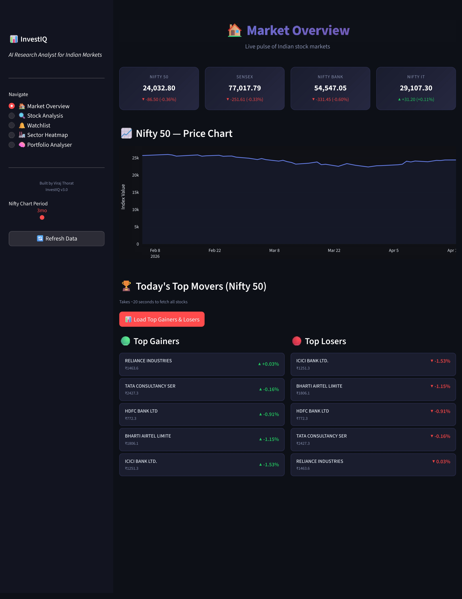
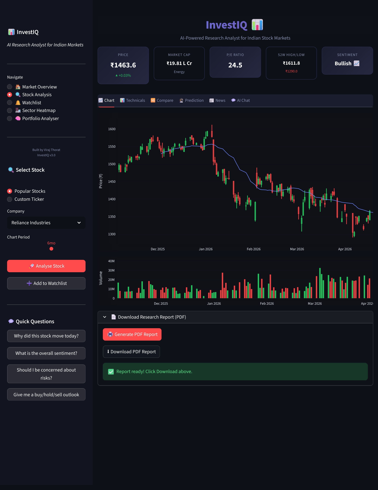
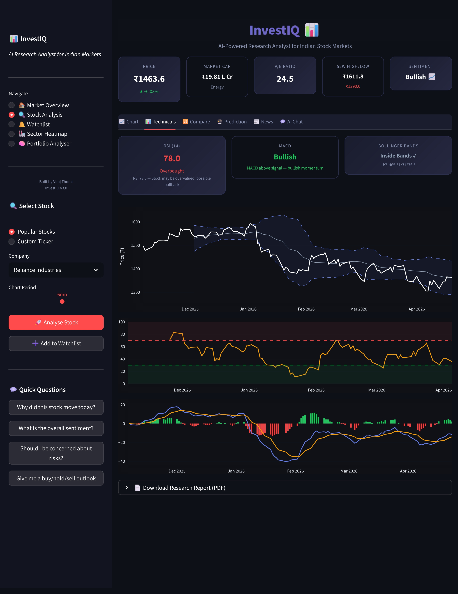
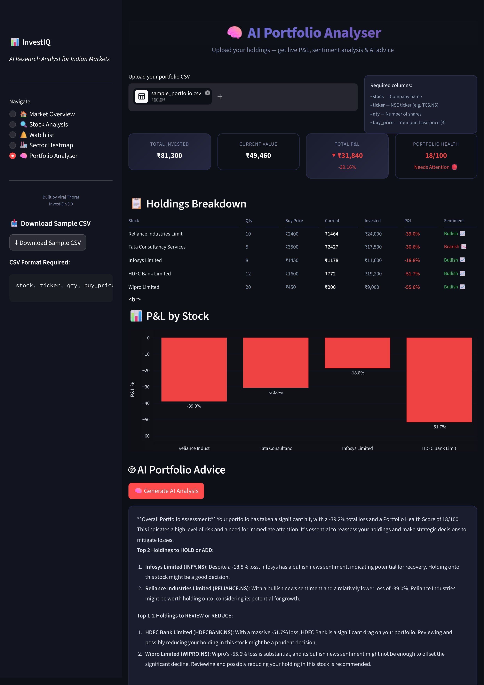
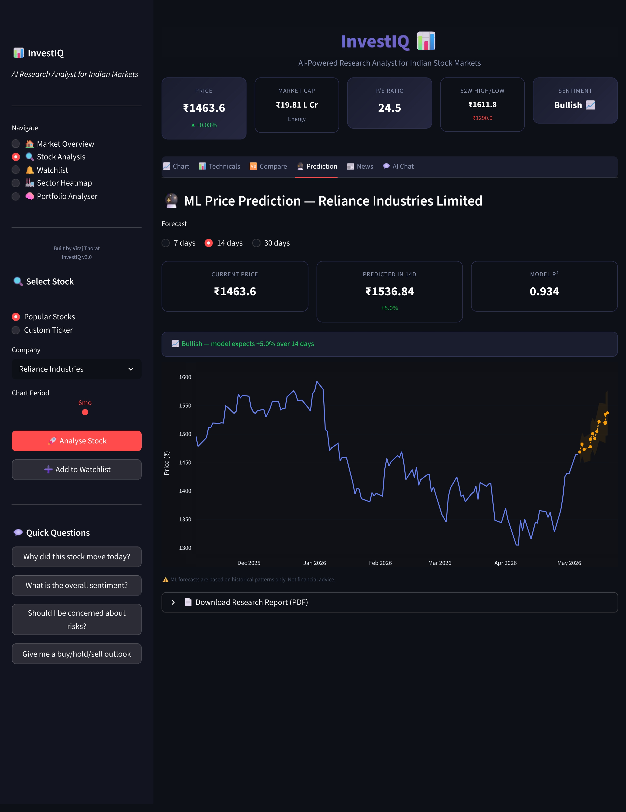
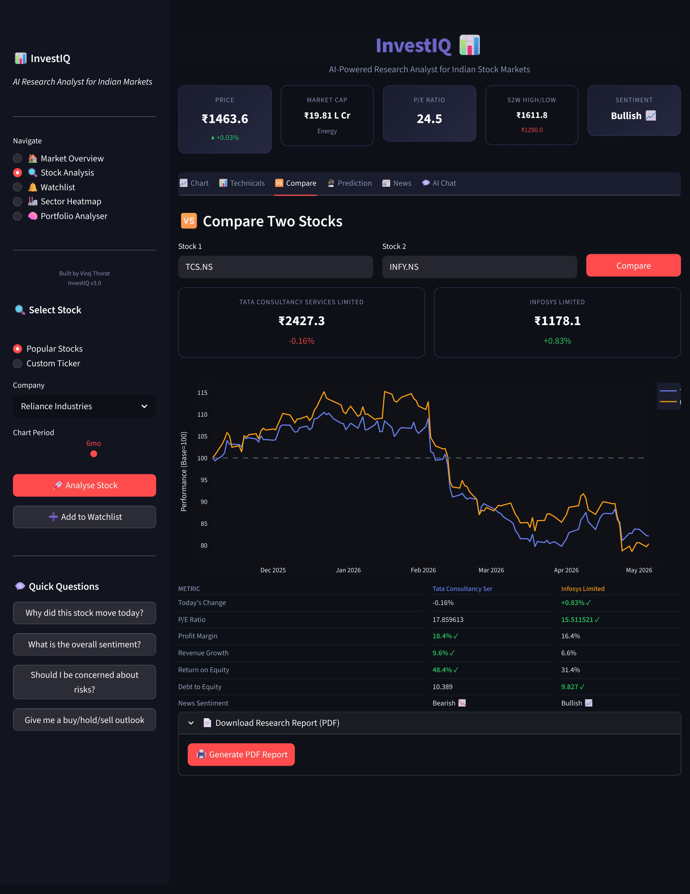
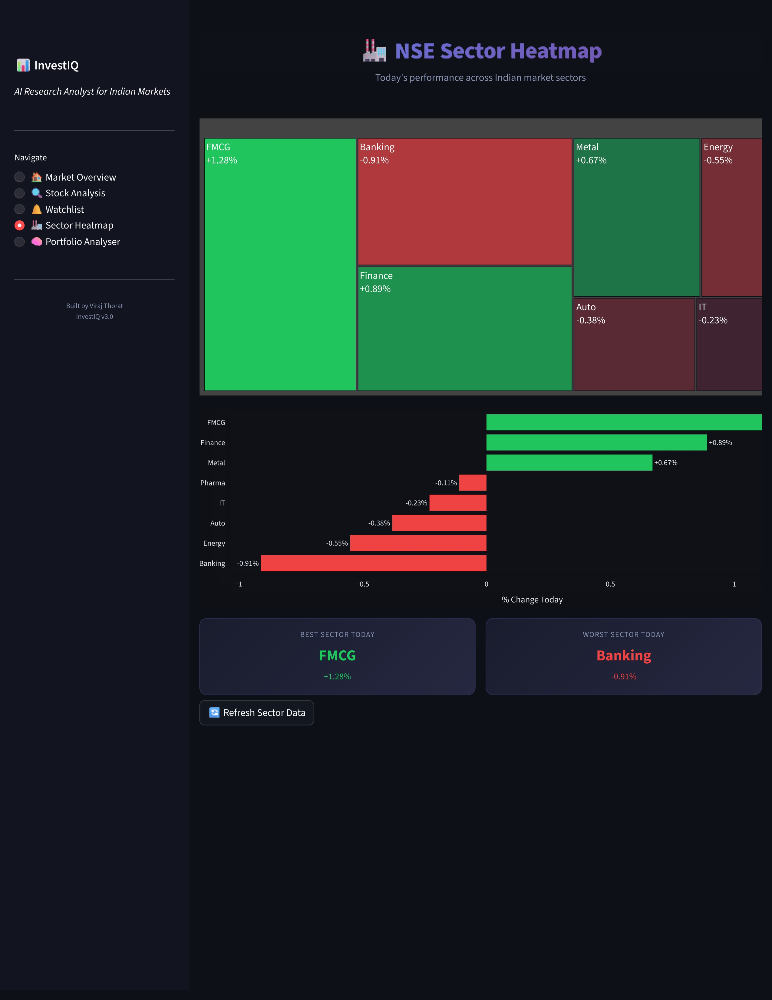
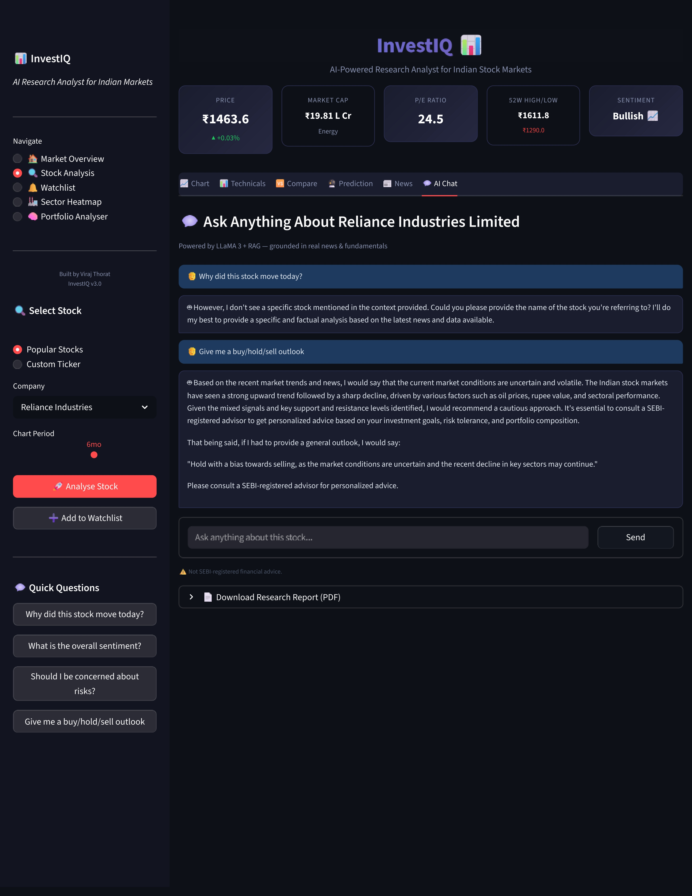
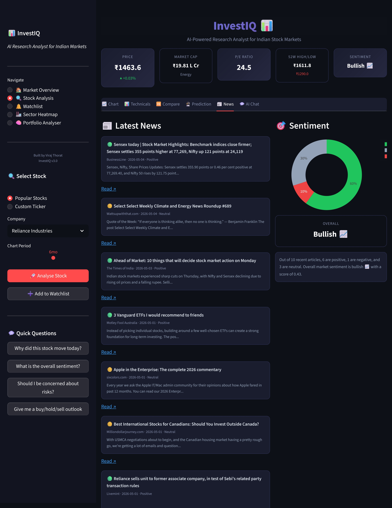

# 🚀 InvestIQ — AI-Powered Stock Intelligence Platform

🔗 **Live App:** https://investiq-3yvyeaqeqwgy2zj8vr2yoy.streamlit.app/     
📂 **GitHub Repo:** https://github.com/virajthorat2004/investiq  

---

## 🧠 What is InvestIQ?

**InvestIQ** is a full-stack AI-powered stock analysis platform designed to act as a **smart investment assistant**.

It combines:
- 📊 Financial data analysis  
- 📈 Technical indicators  
- 🤖 AI-driven insights  
- 📰 News sentiment  
- 📂 Portfolio tracking  

👉 Built to simulate how modern intelligent trading dashboards work.

---

## ⚡ Key Features

### 📊 Market Overview
- Real-time stock data (NSE)
- Key financial metrics

### 📈 Technical Analysis
- RSI, Moving Averages
- Interactive Plotly charts

### 🤖 AI Prediction Engine
- Trend prediction logic
- Data-driven signals

### 📰 News & Sentiment Analysis
- Financial news integration
- Sentiment scoring

### 📂 Portfolio Management
- Track multiple stocks
- Performance insights

### 🔍 Stock Comparison
- Side-by-side comparison

### 📊 Sector Heatmap
- Visual performance of sectors

### 📄 PDF Report Generator
- Export detailed reports

### 🧠 RAG-based AI Assistant
- Intelligent query answering system

---

## 🖼️ Application Preview

### 🔹 Dashboard


---

### 🔹 Stock Analysis


---

### 🔹 Technical Indicators


---

### 🔹 Portfolio Management


---

### 🔹 AI Prediction


---

### 🔹 Stock Comparison


---

### 🔹 Sector Heatmap


---

### 🔹 AI Chat


---

### 🔹 Latest News Fetcher


---

## 🏗️ Project Architecture

```text
investiq/
│
├── app.py                     # Main Streamlit application
│
├── core/                     # Core business logic modules
│   ├── stock_data.py         # Fetch & process stock data
│   ├── technical.py          # Technical indicators (RSI, MACD, etc.)
│   ├── prediction.py         # Stock prediction models
│   ├── sentiment.py          # News sentiment analysis
│   ├── portfolio.py          # Portfolio tracking & metrics
│   ├── market_overview.py    # Market insights & sector data
│   ├── comparison.py         # Multi-stock comparison
│   ├── rag_engine.py         # AI-based query engine (RAG)
│   ├── pdf_report.py         # Report generation
│   ├── watchlist.py          # User watchlist handling
│   └── sector_heatmap.py     # Heatmap visualization
│
├── requirements.txt          # Project dependencies
└── screenshots/              # README images

```
---

## 🛠️ Tech Stack

### 💻 Frontend
- Streamlit

### ⚙️ Backend
- Python

### 📦 Libraries
- pandas
- numpy
- yfinance
- plotly
- pandas-ta
- langchain

---

## ⚙️ Installation Guide

### 1️⃣ Clone the repository

```text
git clone https://github.com/virajthorat2004/investiq.git
cd investiq
```

### 2️⃣ Create virtual environment

```text
python -m venv venv
venv\Scripts\activate
```

### 3️⃣ Install dependencies

```text
pip install -r requirements.txt
```

### ▶️ Run the App Locally

```text
streamlit run app.py
```

---

## 🌐 Deployment

**This app is deployed using Streamlit Community Cloud**

🔗 https://investiq-3yvyeaqeqwgy2zj8vr2yoy.streamlit.app/


## 📊 Example Usage

```text
  Enter stock ticker → RELIANCE.NS
  View price trends and indicators
  Analyze sentiment and predictions
  Track portfolio performance
    🚀 Future Enhancements
    🔐 User authentication system
    📡 Real-time alerts
    🧠 Advanced ML models (LSTM, Transformers)
    ☁️ Cloud database integration
    📱 Mobile responsiveness
```

## 👨‍💻 Author

  ### Viraj Thorat


---

## ⭐ Support

  **If you found this project useful:**
```
  ⭐ Star the repo
  🍴 Fork it
  📢 Share it
```
## ⚠️ Disclaimer
  
  **This project is for educational purposes only.
  Not financial advice.**


---

## 🚀 STEP 4 — Push everything

    git add .
    git commit -m "Added professional README"
    git push
